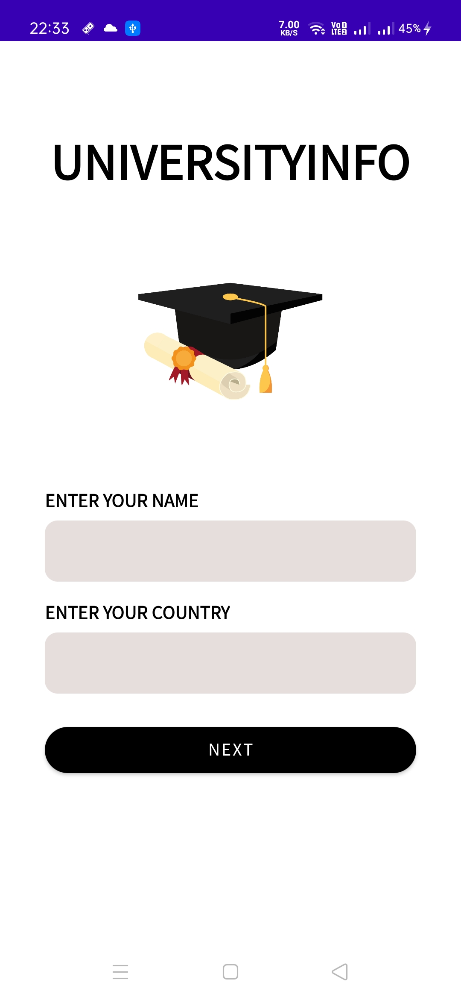

# University_Info_app
An app which shows details of all the universities of your country

||||

https://github.com/harshcoder690/University_Info_app/blob/master/video_1.mp4

## Instructions to use
Follow the given steps to use/debug the app :-

- Open the app and fill your name and the country where u live, click on next page.
- Go to the university for which u want to get the information.
- Click on details button.
- you will be redirected to the information page.
- You are now good to go, when u click on the website link u can check all information there as well.
- You can come back and see more universities information as well.

## Technologies Used

- Retrofit is used to get the data from REST API.
- Intents is used to navigate from one activity to another.
- RecyclerView is used to make a list of universities.
